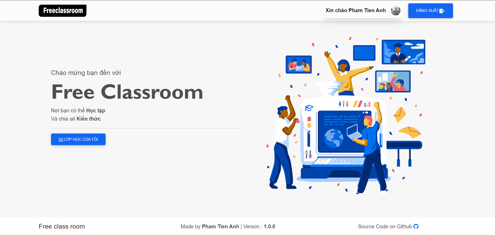
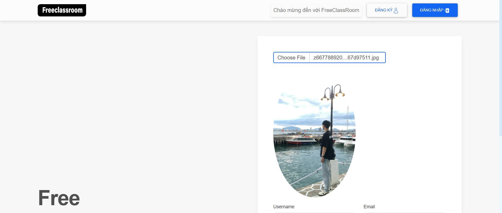
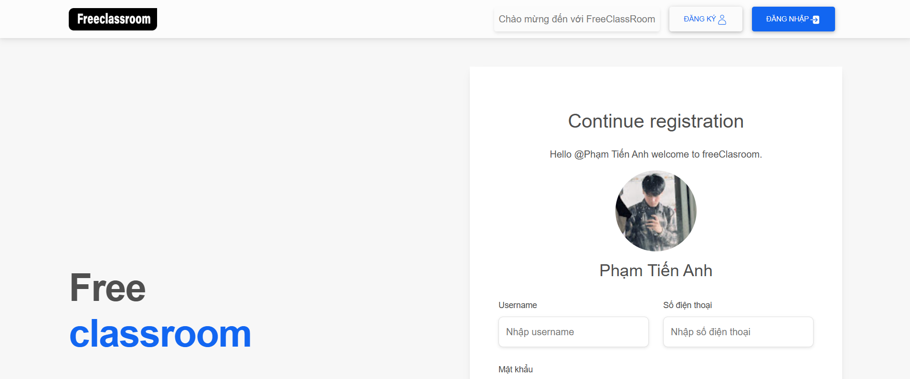
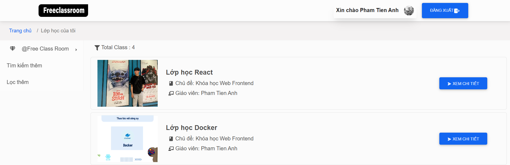
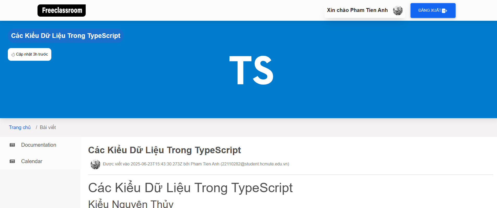

# 📚 FreeClassRoom – Open Learning Platform

A dynamic and secure open learning platform developed as a personal fullstack project since **June 10, 2025**. FreeClassRoom empowers users to create and join online courses, engage in discussions, and share knowledge seamlessly.

---

## 📋 Project Overview

**FreeClassRoom** is an interactive web application focused on enabling open and decentralized learning. Users can register as learners or instructors, create rich courses, publish educational content, and communicate through a social-style feed. The system emphasizes security, responsiveness, and ease of use.

---

## 🛠️ Technologies Used

- **Backend**: Node.js (TypeScript), Express.js, RESTful API, JWT, OAuth2, MongoDB, Redis, RabbitMQ
- **Frontend**: ReactJS, Redux
- **Tools & Services**: Cloudinary, Docker, Postman, GitHub

---

## ✨ Key Features

- 📚 **Course Management**: Create, update, and enroll in educational courses.
- 💬 **Social Interaction**: Users can post questions, share knowledge, and comment on discussions.
- 🧑‍🏫 **Instructor Mode**: Allows users to create learning content and manage enrolled students.
- 🔐 **Secure Authentication**: Integrated Google OAuth2 and JWT for secure access control.
- 🖼️ **Media Handling**: Cloudinary integration for storing images and course content.
- 📣 **Notifications**: Real-time asynchronous notifications using RabbitMQ.
- ⚡ **Performance Optimizations**: Redis used for caching and storing OTP codes.

---

## 🚀 Getting Started

To run the project locally, follow these steps:

1. **Clone the Repository**:
   ```bash
   git clone https://github.com/yourusername/FreeClassRoom
   cd FreeClassRoom
   ```

2. **Set Up Environment Variables**:
   - Create `.env` files for backend services (MongoDB URI, Redis, JWT secret, OAuth credentials, etc.)

3. **Install Dependencies**:
   ```bash
   npm install    # or yarn install
   ```

4. **Run Development Servers**:
   - Backend:
     ```bash
     npm run dev
     ```
   - Frontend:
     ```bash
     cd client
     npm start
     ```

5. **Access Application**:
   Visit `http://localhost:3000` in your browser.

---

## 🧪 Technical Highlights

- ✅ **Frontend**: Built with ReactJS and Redux for a responsive and dynamic user experience.
- 🔐 **Security**: Integrated Google OAuth2 login and protected routes using JWT.
- 🖼️ **Media Upload**: Integrated Cloudinary to manage and store user-generated content like avatars and course images.
- 📬 **Asynchronous Messaging**: RabbitMQ enables event-based notifications such as new enrollments or post replies.
- ⚙️ **Caching**: Redis is used for OTP handling and enhancing API response times.

---


## 🖥️ UI Demo
Discover the intuitive and accessible interface of FreeClassRoom, designed with ReactJS and Redux for a seamless learning experience. Below are the key UI highlights, structured for clarity and ease of navigation.

### 🔐 Login & Registration
Access the platform quickly and securely with flexible authentication options.

- **Screenshots**:
  
  
- **Description**: Simple and clean login form supporting both email/password and Google OAuth2 sign-in.

### 📝 Register & OTP Verification
Secure and user-friendly registration flow with step-by-step validation.

- **Screenshots**:
  
  
  
  
- **Description**: Traditional registration with email and OTP verification, ensuring account authenticity and security.

### 📝 Register with OAuth2 (Google)
Secure and user-friendly registration flow with step-by-step validation.

- **Screenshots**:
  
  
  
- **Description**: Traditional registration with email and OTP verification, ensuring account authenticity and security.

### 🏫 Class Listings
Browse a wide variety of available classes in a paginated and searchable interface.

- **Screenshots**:
  
  
- **Description**: Paginated display of courses with filters for subjects, levels, and instructors.

### 📘 Class Detail View
Dive into the details of each class, including instructor, description, and course outline.

- **Screenshots**:
  
  
  
- **Description**: Rich presentation of class information with enrollment options and student count.

### 🧾 Post Detail View
View full post content with replies, imageS.

- **Screenshots**:
  
  
  
- **Description**: View full post content with replies, imageS.


### 🔔 Teacher Notice & Post Notification  
Receive in-app alerts when a teacher publishes a new post or notice.

- **Screenshots**:  
    
    


